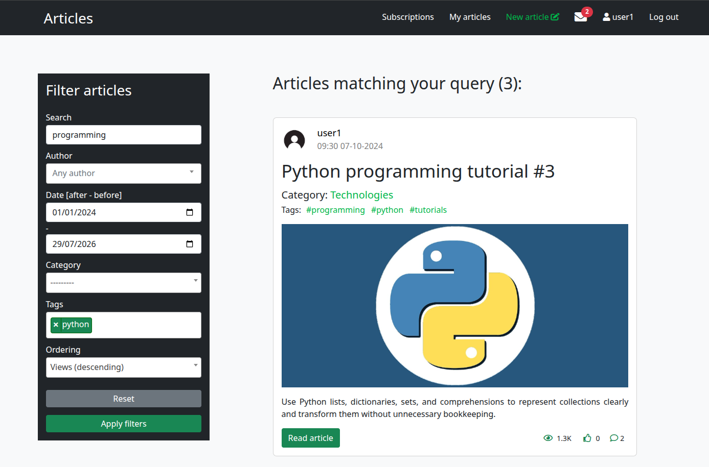
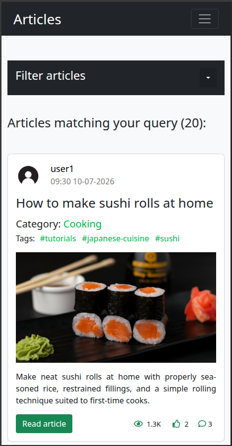
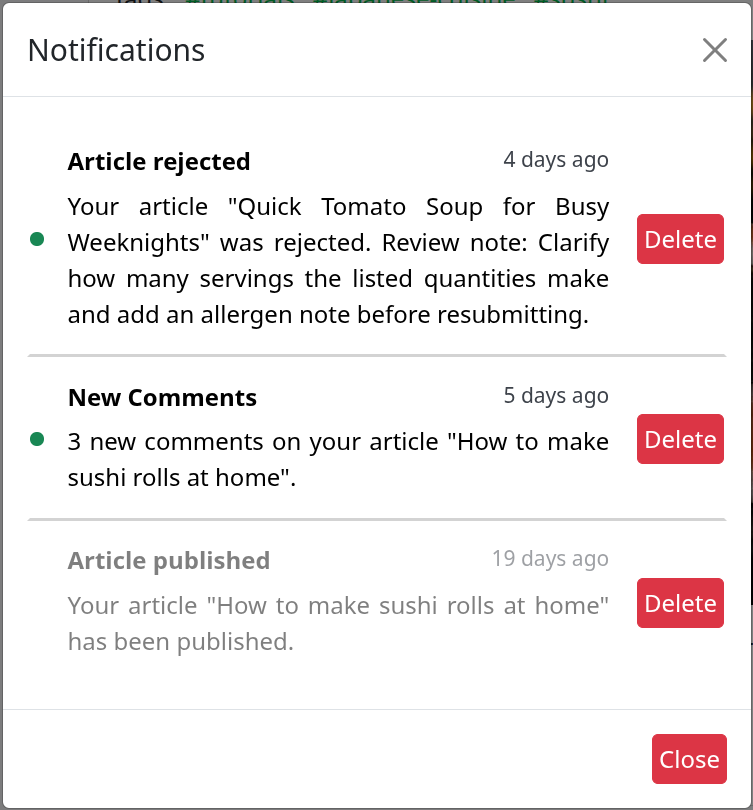
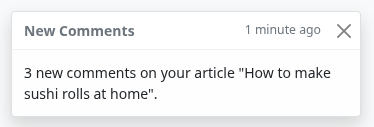
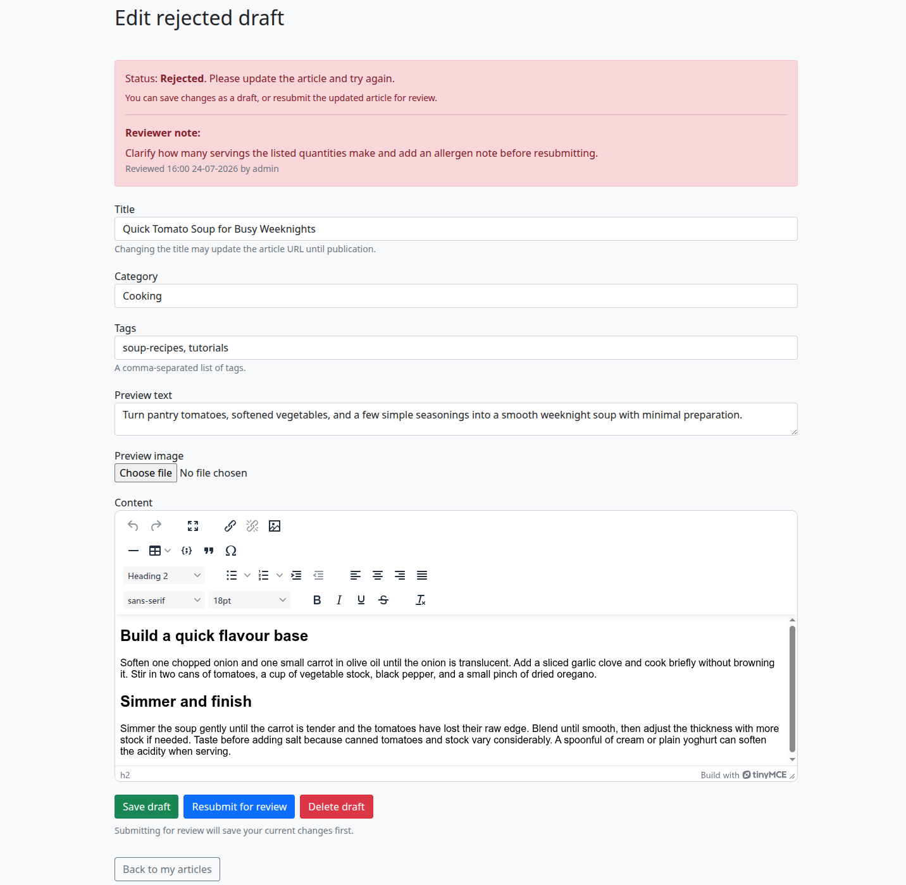
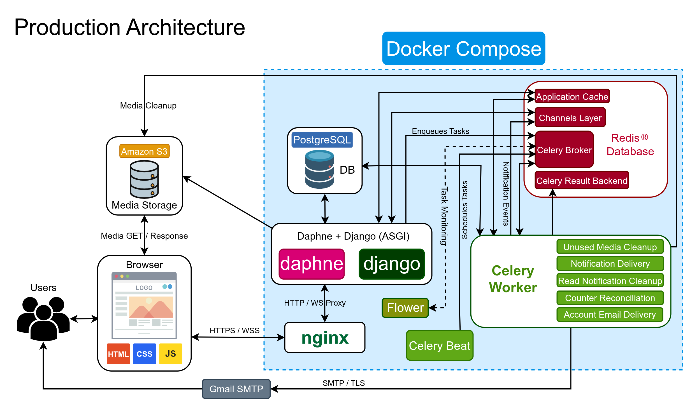
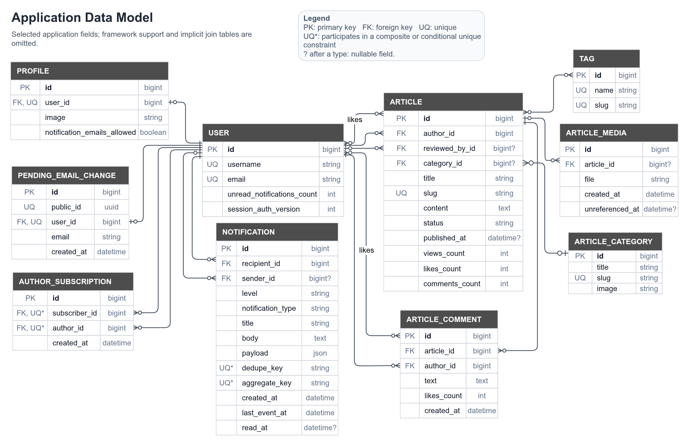

# Articles

Articles is a full-stack server-rendered publishing platform built with Django.
It includes rich-text editing, moderated publishing workflows, full-text search,
and persistent notifications with real-time browser updates.

The project focuses on backend architecture, data integrity, concurrency,
asynchronous processing, and production operations.

**Live application:** <https://articles.nsorokopud.com>

**Demo user:** `user1` or `user1@articles.test`, password: `ArticlesDemo2026`

## Features

- Rich-text editing with inline images and server-side HTML sanitization
- Moderated article workflow: submit, withdraw, approve, reject, unpublish, delete
- Full-text article search with filtering, sorting, and pagination
- Author subscriptions and a personalized article feed
- Comments, likes, categories, tags, and deduplicated view counting
- Persistent notification inbox with aggregation and real-time browser updates
- Email delivery for selected system events
- Username-or-email login, Google OAuth, confirmed email changes, and password management
- Amazon S3 media storage
- Scheduled tasks for counter reconciliation, notification retention, expired
  email change cleanup and abandoned media cleanup

## Technology Stack

- **Backend:** Python 3.12, Django 5.2
- **Frontend:** Django templates, HTML, CSS, JavaScript, Bootstrap, TinyMCE
- **Data stores:** PostgreSQL 17, Redis 7
- **Background processing:** Celery, Celery Beat
- **Real-time delivery:** Django Channels, Daphne
- **Authentication and security:** django-allauth, hCaptcha, nh3
- **Infrastructure:** Docker Compose, Nginx, Amazon S3
- **Observability:** Flower, Sentry
- **CI/CD:** GitHub Actions

## Technical Highlights

### Transactional publishing workflow

Articles move among draft, pending-review, published, and rejected states through
services that acquire row-level locks.

The service layer rejects invalid transitions, while PostgreSQL check constraints
enforce core rules such as valid publication timestamps and required content for
non-draft articles.

Cache invalidation and notification dispatch are registered with
`transaction.on_commit()`, preventing side effects from running before the DB
transaction succeeds.

### PostgreSQL full-text search

A persisted, generated `tsvector` weights the article title, preview text, and
body. Search combines PostgreSQL web-style full-text queries with trigram title
similarity, while partial GIN indexes cover published content.

This provides stemming, weighted ranking, and tolerant title matching without
introducing a separate search service.

### Atomic and batched counters

Likes and comments use atomic Django `F()` updates to avoid lost updates during
concurrent requests.

A Redis Lua script atomically deduplicates viewer registrations and increments
view counters. Workers flush accumulated deltas to PostgreSQL in bounded batches,
while scheduled Celery tasks reconcile like and comment counters with their
source records.

This keeps common reads inexpensive while limiting the impact of counter drift.

### Durable notifications and real-time delivery

PostgreSQL is the source of truth for the notification inbox. Repeated unread
comment events for the same recipient and article are combined using a partial
unique constraint and conflict-recovery logic.

Celery dispatches updates through Django Channels, while Redis-backed throttling
reduces bursts to digest hints. WebSocket delivery is best effort; clients recover
from missed events through the persistent inbox.

### Rich-text and media safety

nh3 applies a server-side HTML allowlist. Links and image sources are restricted,
uploads are checked by size and detected MIME type, and inline-media references
are tracked for delayed cleanup.

Editor output is treated as untrusted even though it comes from TinyMCE.
Reference-aware delayed cleanup allows abandoned uploads to be removed safely.

### Account and session integrity

Usernames and email addresses are normalized and protected by case-insensitive
DB constraints. Email changes require time-limited confirmation and invalidate
existing sessions. Google sign-in requires a provider-verified email that
matches the login identity.

Identity rules are enforced at both form/service and DB boundaries.

## Screenshots

### Search and filtering

[](docs/screenshots/article-filtering.png)

<details>
<summary><strong>View more screenshots</strong></summary>

<p><strong>Mobile layout</strong></p>

<p align="center">
  <a href="docs/screenshots/article-list-mobile.png">
    
  </a>
</p>

<p><strong>Notifications</strong></p>

<table align="center">
  <tr>
    <th width="60%">Persistent inbox</th>
    <th width="40%">Real-time toast</th>
  </tr>
  <tr>
    <td align="center" valign="middle">
      <a href="docs/screenshots/notification-inbox.png">
        
      </a>
    </td>
    <td align="center" valign="middle">
      <a href="docs/screenshots/notification-toast.png">
        
      </a>
    </td>
  </tr>
</table>

<p><strong>Writing and moderation</strong></p>

[](docs/screenshots/rejected-article-editor.png)

</details>

## Architecture

The application is a modular monolith. Django serves HTML and small JSON
responses; JavaScript is limited to focused interactions such as filtering,
likes, uploads, editing, and notifications.

[](docs/architecture.png)

The main boundaries are:

- **Views** handle HTTP concerns such as authentication, permissions, forms,
  redirects, pagination, and response formats.
- **Selectors** build reusable read querysets and apply eager loading.
- **Services** coordinate writes, enforce domain transitions, and handle
  concurrency through row locks or guarded atomic updates.
- **Models and migrations** provide the final integrity boundary through
  constraints and indexes.
- **Tasks** handle retryable and scheduled work. Cache locks prevent overlapping
  maintenance runs.

Side effects that must not precede a successful write are registered with
`transaction.on_commit()`. These include cache invalidation and notification
dispatch. This avoids announcing work that is later rolled back while keeping
external operations outside DB transactions.

## Data Model

[](docs/data-model.png)

The diagram shows selected application fields and omits framework support tables
and implicit many-to-many join tables.

Beyond the relationships shown, the schema includes DB-enforced article workflow
checks, case-insensitive uniqueness for usernames and email addresses, unique
author-subscription pairs with self-subscriptions prohibited, conditional
uniqueness for notification aggregation, and partial indexes optimized for
published-article search and feed queries.

## Design Decisions and Limitations

- **Modular monolith:** Keeping the domain in one application preserves simple
  transactions and clear data ownership. Separate Celery workers provide
  asynchronous execution without fragmenting the data model.
- **Server-rendered interface:** The project has no general-purpose REST or
  GraphQL API. Small JSON endpoints support specific page interactions.
- **PostgreSQL search:** Weighted ranking and fuzzy matching provide capable
  search without the operational cost of a separate search service. Search is
  English-only and is not designed for very large corpora.
- **Approximate view counts:** Redis deduplicates viewers within a time window
  and batches database writes. A worker crash after Redis `GETDEL` can lose a
  small number of views.
- **Denormalized counters:** Stored counters make common reads cheaper but can
  drift. Atomic updates handle normal traffic, while scheduled reconciliation
  repairs discrepancies.
- **Best-effort live delivery:** WebSocket events are not retried indefinitely;
  clients recover through the durable notification inbox.
- **Single-host deployment:** The included Compose deployment does not provide
  high availability, rolling releases, autoscaling, automated backups, or
  disaster recovery.
- **Mocked external integrations in CI:** Tests use mocks or test backends
  instead of live Google, hCaptcha, S3, SMTP, and Sentry services.

## Code Tour

- [Article model](apps/articles/models.py): generated search vector,
  DB-enforced workflow constraints, denormalized counters, partial indexes
- [Publishing service](apps/articles/services/publishing.py): transactional,
  row-locked workflow transitions and post-commit side effects
- [Editing pipeline](apps/articles/services/editing.py) and
  [HTML sanitizer](apps/articles/services/sanitization.py): transactional saves,
  HTML allowlisting, searchable-text extraction, collision-safe slug generation,
  and inline-media reference syncing
- [Search selectors](apps/articles/selectors.py): ranked PostgreSQL full-text and
  trigram search with eager-loaded article querysets
- [Redis view counters](apps/articles/cache/view_counts.py): Lua-based atomic
  registration, bounded batch claims, and restoration after DB write failures
- [Notification model](apps/notifications/models.py) and
  [comment aggregation service](apps/notifications/services/comment_aggregation.py):
  a partial unique constraint, row locking, and conflict recovery for concurrent
  comment notifications
- [WebSocket delivery](apps/notifications/services/delivery_ws.py) and
  [consumer](apps/notifications/consumers.py): throttled notification delivery,
  timeout handling, and authenticated push-only connections
- [Confirmed email changes](apps/users/services/email_addresses.py): token
  validation, race-safe uniqueness handling, session invalidation, and
  social-account cleanup
- [View-counter tests](apps/articles/tests/cache/test_view_counts.py) and
  [ASGI consumer tests](apps/notifications/tests/test_consumers.py): examples of
  testing infrastructure failures, recovery paths, and asynchronous behavior

## Run Locally with Docker

### Prerequisites

Install Docker Desktop on Windows or macOS. On Linux, install Docker Engine with
the Compose plugin. Docker Compose 2.24.4 or later is required.

On Windows, configure Docker Desktop to use Linux containers.

### Setup

1. Copy `.env.docker.example` to a new file named `.env.docker` using your file
   manager or shell.

2. **Recommended:** Pull the prebuilt development images from Docker Hub:

   ```bash
   docker compose --env-file .env.docker pull web-app nginx
   ```

   This avoids building the application images locally. To build them from
   source instead, run:

   ```bash
   docker compose --env-file .env.docker build web-app nginx
   ```

3. Start the dependency services, initialize the application, and load the demo
   content shown in the screenshots:

   ```bash
   docker compose --env-file .env.docker up -d --wait db redis
   docker compose --env-file .env.docker run --rm web-app python manage.py migrate
   docker compose --env-file .env.docker run --rm web-app python manage.py collectstatic --noinput
   docker compose --env-file .env.docker run --rm web-app python manage.py loaddata fixtures/initial_data.json
   docker compose --env-file .env.docker run --rm web-app python manage.py collect_fixture_media --noinput
   ```

4. Start the application:

   ```bash
   docker compose --env-file .env.docker up
   ```

### Local URLs

- **Application:** <http://localhost/>
- **Django development server:** <http://localhost:8000/>
- **Flower task monitor:** <http://localhost:5555/__flower__/>

Flower uses the credentials specified by `FLOWER_BASIC_AUTH` in `.env.docker`.

### Stop the Application

Press <kbd>Ctrl</kbd>+<kbd>C</kbd> to stop the foreground stack, then remove
the containers and network:

```bash
docker compose --env-file .env.docker down
```

## Testing and Code Quality

The test suite covers models, selectors, services, views, background tasks,
Redis integrations, and ASGI consumers. Tests run against PostgreSQL, while
Redis integration tests use a dedicated Redis test database.

With `.env.docker` configured and the development image pulled or built as
described in [Run Locally with Docker](#run-locally-with-docker), start the
dependencies and run the suite:

```bash
docker compose --env-file .env.docker up -d --wait db redis
docker compose --env-file .env.docker run --rm -e DJANGO_SETTINGS_MODULE=config.settings.test -e TEST_REDIS_URL=redis://redis:6379/15 web-app pytest -n=auto --dist=loadgroup .
```

Tests run in parallel. Tests that use real Redis are assigned to the same worker
because they share and reset the dedicated Redis test DB.

The [test workflow](.github/workflows/run-tests.yaml) runs Django system checks,
verifies that no database migrations are missing, applies the migrations, and
executes the suite using health-checked PostgreSQL and Redis services.

The [quality workflow](.github/workflows/run-code-quality-tools.yaml) checks
formatting, linting, type checking, templates, frontend code, and security.

Corresponding local hooks are configured in
[`.pre-commit-config.yaml`](.pre-commit-config.yaml).

## Deployment

Production uses a single-host Docker Compose deployment based on the
[base Compose configuration](docker-compose.yaml), without the
[local-development override](docker-compose.override.yaml). Nginx terminates
HTTPS and proxies HTTP and WebSocket traffic to
Daphne.

The stack includes Daphne/Django, PostgreSQL, Redis, a Celery worker, Celery
Beat, and Flower, with restart policies, persistent volumes, health checks, and
dependency conditions.

The [production settings](config/settings/production.py) enforce HTTPS and
secure cookies, configure Amazon S3 for media storage, use manifest-based static
files, and support optional Sentry monitoring and rotating-file logging.

On pushes to `master`, the [deployment workflow](.github/workflows/cd.yaml)
builds and publishes the application and Nginx images, validates the remote
configuration, runs Django deployment checks and database migrations, collects
static files, and starts the production stack.

[`.env.production.example`](.env.production.example) documents the required
configuration variables.
